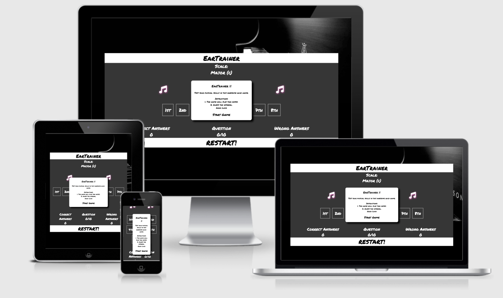
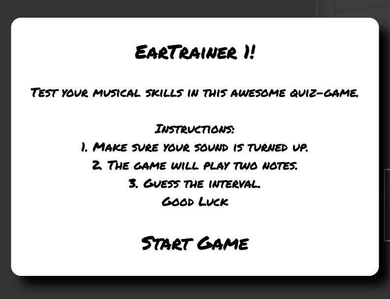
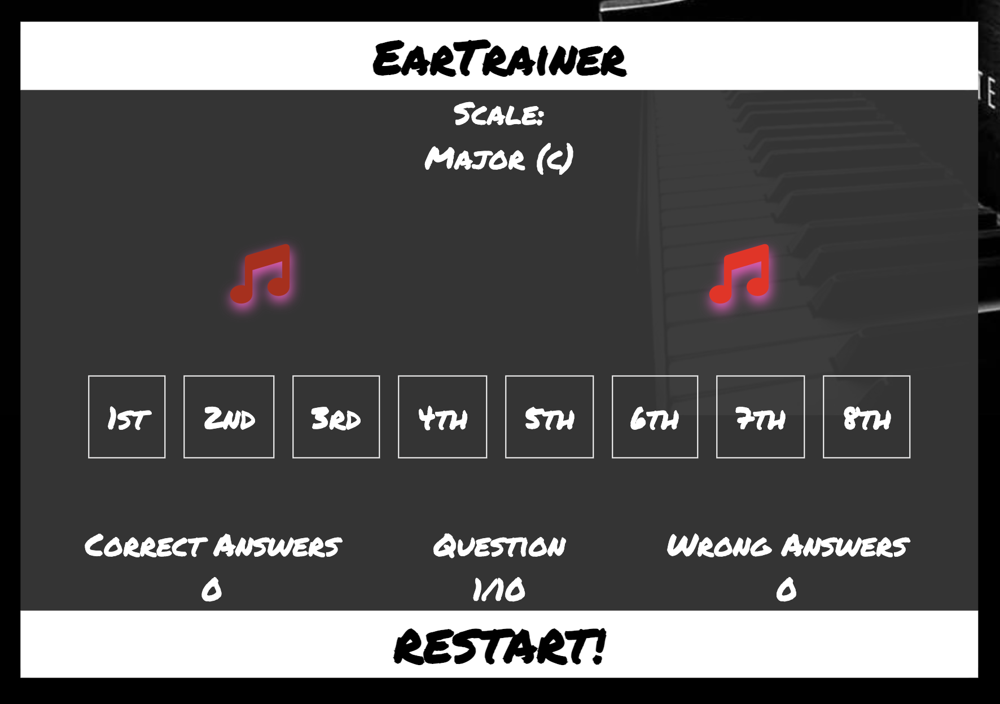
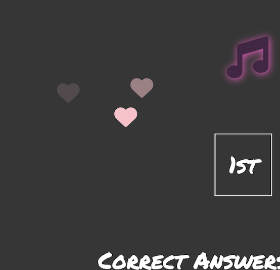
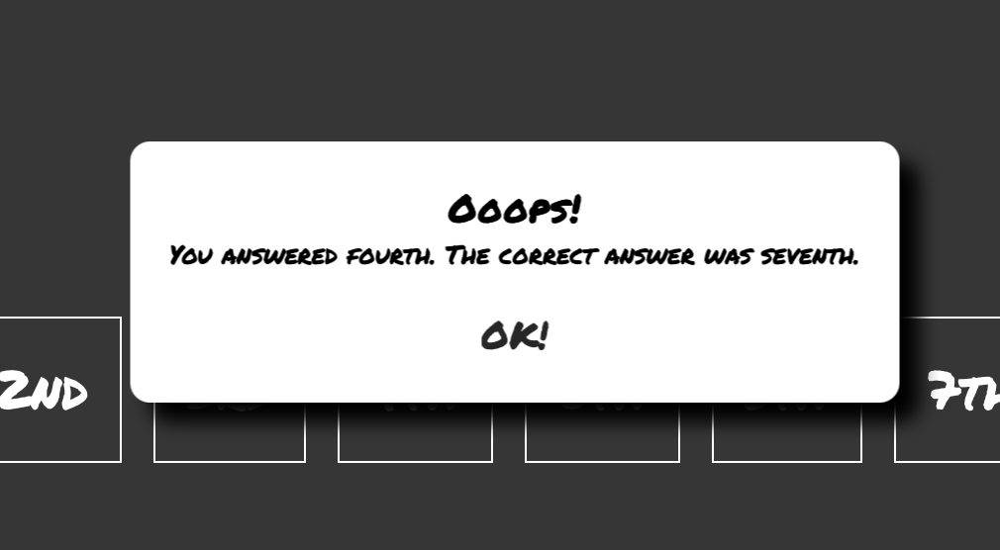
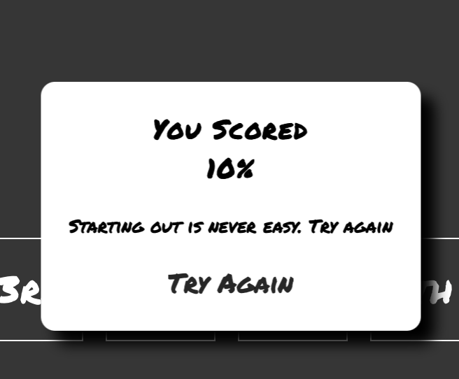

# EarTrainer

Ask any musician and they will tell you that hearing is the number one most important skill in a musicians, producers or singers toolbox. Without it you are doomed. That's why EarTrainer is your best friend and tutor. With this fun and simple quiz game your hearing will improve at a high pace giving you the skillset you need to pursuit your musical career.

Good luck!

## Table of Content

1. [Features](#features)
2. [Testing](#testing)
3. [Deployment](#deployment)
4. [Credits](#credits)

## Features 

- Welcome Modal
- Main View
- Anwer Feedback
- Next Question
- Score Summary

### Welcome modal
The welcome modal provides the user with a greeting and instructions as well as a 'start game' button. By keeping the introduction short the player is quickly engaged in the game.

### main view
When the 'Start Game' button is clicked the player will hear first one and then a second note and will be able to guess the interval by pressing one of the eight buttons convieniently placed within thumb-reach (if on a smartphone). On the top, just under the logo you can see the current scale as well as two notes who are animated so that one the first note is played, the left one is changing colors and when the second one is played, the right one will do the same.
The number of correct and wrong answers as well as the current question number is also visible here.

### Answer feedback
When the player made a choice and pressed a button the feedback is instant to make sure the players engagement is not dropped. If the guess was right, hearts will flow up from the bottom left corner making them always visable for right hand users. If the answer is wrong a modal will show the guess and the right answer so that the player can easily improve until next time that note comes up.

### next Question
After the feedback the next question comes automaticaly, again to make sure the engagement is up. The loop then continues until the 10th question is answered.

### score summary
After the 10th question the player is showed their score in percent and a message based on their score and are prompted to try again.
All they have to do is press the button and they are back to the welcome modal and can try again.

### Future Features

- Game Structure
  - 1st level note 3, 5 and seven of the major scale
  - 2nd level including all notes of the major scale
  - 3rd level note 3, 5 and seven of the minor scale  
  - 4th level including all notes of the minor scale
  - 5th level mixing thirds and sevens from minor and major scale
  - 6th level chromatic
- There are so many possibilities to this game. it would be great to create all scales and mix them in different ways and also change the key of the scales etc. 

## Testing 

Throughout development the game has been continuously tested on an iphone 12 and a macbook 15" late 2018 using Chrome, safari and Duck Duck Go.

After finishing the first running good beta version i asked the slack community as well as my friends and family to try the game.

The game has now been tested on:

- iphone 12 
    - Safari
    - chrome
    - Duck Duck Go
- iphone 13
    - safari
    - chrome
- Iphone 13 Pro MAX
    - safari
-   macbook pro 15"
    - chrome
    - safari
    - edge

### Tablets and Regular size laptop screens
Game is centered 

### Smaller screens

Essentially, in this part you will want to go over all of your project’s features and ensure that they all work as intended, with the project providing an easy and straightforward way for the users to achieve their goals.

In addition, you should mention in this section how your project looks and works on different browsers and screen sizes.

You should also mention in this section any interesting bugs or problems you discovered during your testing, even if you haven't addressed them yet.

If this section grows too long, you may want to split it off into a separate file and link to it from here.

### Validator Testing 

- HTML
    - No errors were returned when passing through the official [W3C validator](https://validator.w3.org/nu/?doc=https%3A%2F%2Fcode-institute-org.github.io%2Flove-maths%2F)
- CSS
    - No errors were found when passing through the official [(Jigsaw) validator](https://jigsaw.w3.org/css-validator/validator?uri=https%3A%2F%2Fvalidator.w3.org%2Fnu%2F%3Fdoc%3Dhttps%253A%252F%252Fcode-institute-org.github.io%252Flove-maths%252F&profile=css3svg&usermedium=all&warning=1&vextwarning=&lang=en)
- JavaScript
    - No errors were found when passing through the official [Jshint validator](https://jshint.com/)
      - The following metrics were returned: 
      - There are 11 functions in this file.
      - Function with the largest signature takes 2 arguments, while the median is 0.
      - Largest function has 10 statements in it, while the median is 3.
      - The most complex function has a cyclomatic complexity value of 4 while the median is 2.

### Unfixed Bugs

So far it has looked good on all physical devices. But on Chromes DevTools there seemst to be issues with the game-canvas height.

One bug that a friend found is that on his, and only his macbook the game sometimes does not reset after the score modal. This bug i have not been able to reproduce.

You will need to mention unfixed bugs and why they were not fixed. This section should include shortcomings of the frameworks or technologies used. Although time can be a big variable to consider, paucity of time and difficulty understanding implementation is not a valid reason to leave bugs unfixed. 

## Deployment 

- The site was deployed to GitHub pages. The steps to deploy are as follows: 
  - In the GitHub repository, navigate to the Settings tab 
  - From the source section drop-down menu, select the Master Branch
  - Once the master branch has been selected, the page will be automatically refreshed with a detailed ribbon display to indicate the successful deployment. 

The live link can be found here - https://catbackmancasino.github.io/PP2earTraining/

## Credits 

Thanks to:
Stack Overflow CSS code to center absolute element:  https://stackoverflow.com/questions/39627549/how-to-center-modal-to-the-center-of-screen 
Stina Caroline Axelsson - testinig
Brian Macharia - Idea inspiration
Bim Williams - Guidence in audio and arrays

### Content 

font awesone
google fonts

### Media

Background photo - Stenway Pianos
Samples - Native instruments
Mockup image - http://ami.responsivedesign.is/
