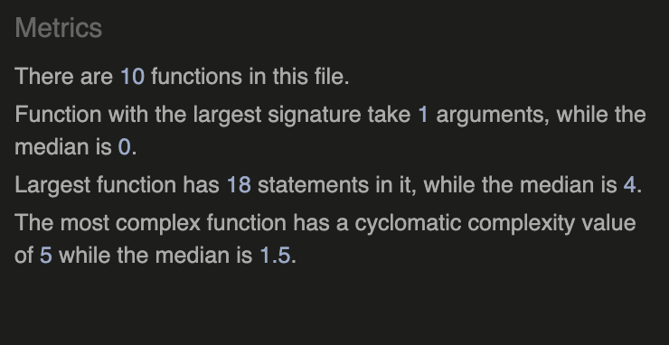
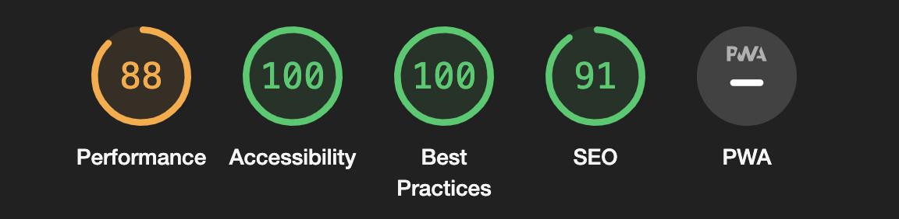

# EarTrainer

Ask any musician, and they will tell you that hearing is the number one most important skill in a musician, producers or singers toolbox. Without it you are doomed. That's why EarTrainer is your best friend and tutor. With this fun and simple quiz game your hearing will improve at a high pace giving you the skill set you need to pursuit your musical career.

Oh, and it's also OK to play if you just want to play a fun game.

Good luck!

## Table of Content

1. [Features](#features)
2. [Testing](#testing)
3. [Deployment](#deployment)
4. [Credits](#credits)

## Features 

- [Welcome Modal](#welcome-modal)
- [Main View](#main-view)
- [Answer Feedback](#answer-feedback)
- [Next Question](#next-question)
- [Score Summary](#score-summary)

### Welcome modal
The welcome modal provides the user with a greeting and instructions as well as a 'start game' button. By keeping the introduction positive and simple, the player is quickly launched into the game.

### Main view
When the 'Start Game' button is clicked the player will first hear one and then a second note and will be prompted to guess the interval by pressing one of the eight buttons conveniently placed within thumb-reach (if on a smartphone). On the top, just under the logo you can see the current scale as well as two notes who are animated so that when the first note is played, the left one is changing colors and when the second one is played, the right one will do the same to indicate to the user that sound should be playing
The number of correct and wrong answers as well as the current question number is also visible here.

### Answer feedback
When the player made a choice and pressed a button the feedback is instant to make sure the players' engagement is not dropped. If the guess was right, hearts will flow up from the bottom left corner making them always visible for right-hand users. If the answer is wrong a modal will show the guess and the right answer so that the player can easily improve until next time that note comes up.

### Next Question
After the feedback the next question comes automatically, again to make sure the engagement isn't dropped. The loop then continues until the 10th question is answered.

### Score summary
After the 10th question the player is showed their score and a message based on their score and are prompted to try again.
All they have to do is press the button, and they are back to the welcome modal and can try again.

There are several different messages at the end of the game. Have you seen them all?

### Future Features
- Make answer alternatives light up after the first notes are played so to indicate that's where the buttons are. Just a nice looking feature but not important.
- Game Structure
 - 1st level note 3, 5 and seven of the major scale
 - 2nd level including all notes of the major scale
 - 3rd level note 3, 5 and seven of the minor scale 
 - 4th level including all notes of the minor scale
 - 5th level mixing thirds and sevens from minor and major scale
 - 6th level chromatic
- There are so many possibilities to this game. It would be great to create all scales and mix them in different ways and also change the key of the scales etc. 

## Testing 

Throughout development the game has been continuously tested on an iPhone 12 and a mac book 15" late 2018 using Chrome, safari and Duck Go.

After finishing the first running good beta version i asked the slack community as well as my friends and family to try the game.

The game has now been tested on:

- iPhone 12 
 - Safari
 - chrome
 - Duck Go
- iPhone 13
 - safari
 - chrome
- iPhone 13 Pro MAX
 - safari
- mac book pro 15"
 - chrome
 - safari
 - edge

### responsive design
The game has been designed using grids and flex boxes to ensure it translates well to any screen size. A few media queries have been added for the extremely large screens and also for small screens.

#### Large screens
Background image removed because the resolution was not high enough.

#### Small screens
Slightly smaller font on result section

An interesting bug is that on one computer at one occasion the game never reset but just went on and on. 
Other than that the game looks and acts as intended.

### Validator Testing 

- HTML
 - No errors were returned when passing through the official [W3C validator](https://validator.w3.org/nu/?doc=https%3A%2F%2Fcatbackmancasino.github.io%2FPP2earTraining%2F)
- CSS
 - No errors were found when passing through the official [(Jigsaw) validator](https://jigsaw.w3.org/css-validator/validator?uri=https%3A%2F%2Fcatbackmancasino.github.io%2FPP2earTraining%2F&profile=css3svg&usermedium=all&warning=1&vextwarning=&lang=sv)
- JavaScript
 - No errors were found when passing through the official [Jshint validator](https://jshint.com/)
 - The following metrics were returned: 
 - There are 10 functions in this file.
      - Function with the largest signature takes 1 arguments, while the median is 4.
      - The Largest function has 18 statements in it, while the median is 3.
      - The most complex function has a cyclomatic complexity value of 5 while the median is 1.5.
      

### Lighthouse Score

### Unfixed Bugs

So far it has looked good on all physical devices. But on Chromes Retools there seems to be issues with the game-canvas height. (FIXED)
One bug that a friend found is that on his, and only his mac book the game sometimes does not reset after the score modal. This bug i have not been able to reproduce.

The hearts running when a correct answer is submitted are made using CSS and the JS runs and pauses the animation a set amount of time using setTimeout. This causes the loop not to be perfect and so the hearts have a slightly different start/stop point for each run. This problem is not major but should be fixed.

## Deployment 

- The site was deployed to GitHub pages. The steps to deploy are as follows: 
 - In the GitHub repository, navigate to the Settings tab 
 - From the source section drop-down menu, select the Master Branch
 - Once the master branch has been selected, the page will be automatically refreshed with a detailed ribbon display to indicate the successful deployment. 

The live link can be found here - https://catbackmancasino.github.io/PP2earTraining/

## Credits 

Thanks to:
Stack Overflow CSS code to center absolute element: https://stackoverflow.com/questions/39627549/how-to-center-modal-to-the-center-of-screen 
Stina Caroline Abelson - testing
Brian Mach aria - Idea inspiration
Bim Williams - Guidance in audio and arrays
Danuta Beckman - testing
Rille Maelstrom - Testing
Svursten Donk - Testing
Isabella Beckman - Testing
Robin Rodriguez - Testing

### Content 
Deployment part of read me by: Code Institute
Icons by Font Awesome
Fonts by Google Fonts

### Media
Background photo - Steinway Pianos
Piano Samples - Native instruments
Mock up image - http://ami.responsivedesign.is/